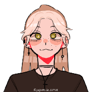
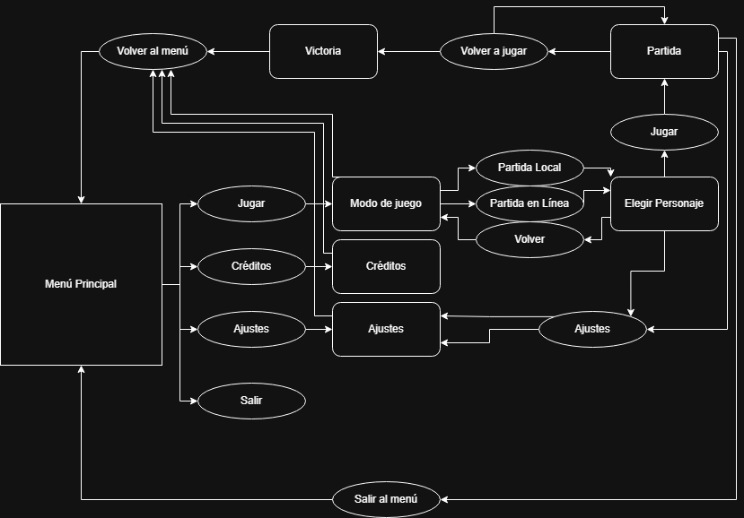
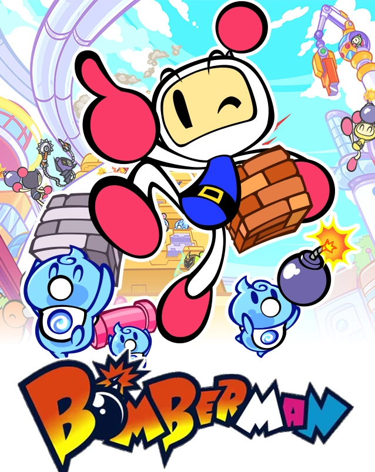

# Fase 1

Nombre:  **BombPainting**

Temática: **Arcade**  

Enlace repositorio de GitHub: [BombPainting](https://github.com/danitjela/BombPainting)

Grupo 2:

**INTEGRANTES DEL EQUIPO**

|  |  | |
|-----|-----|-----|
| **Ester Díaz Monzonis** | **Raúl Benítez Tiburón** | **Aroa Quiroga Martínez** |
| **Correo Universidad:**  [e.diazm.2023@alumnos.urjc.es](mailto:e.diazm.2023@alumnos.urjc.es) | **Correo Universidad:** [r.benitez.2023@alumnos.urjc.es](mailto:r.benitez.2023@alumnos.urjc.es) | **Correo Universidad:** [a.quiroga.2023@alumnos.urjc.es](mailto:a.quiroga.2023@alumnos.urjc.es) |
| **Cuenta Github:** aester22 | **Cuenta Github:** Raul-BT | **Cuenta Github:** aroa181 |

|  |  |
|-----|-----|
| **Sandra Sáez Piña** | **Daniela Tocino Jiménez** |
| **Correo Universidad:**  [s.saezp.2023@alumnos.urjc.es](mailto:s.saezp.2023@alumnos.urjc.es) | **Correo Universidad:** [d.tocino.2023@alumnos.urjc.es](mailto:d.tocino.2023@alumnos.urjc.es) |
| **Cuenta Github:** SpolakK | **Cuenta Github:** danitjela |

## ÍNDICE	

1. [INTRODUCCIÓN](#introduccion)
2. [ESPECIFICACIONES BÁSICAS](#especificaciones-basicas)
3. [IMAGEN Y DISEÑO VISUAL](#imagen-y-disegno-visual)
	- [BOCETOS](#bocetos)
	- [LOGOTIPO](#logotipo)
	- [DESCRIPCIÓN VISUAL](#descripcion-visual)
	- [ASPECTOS TÉCNICOS](#aspectos-tecnicos)
	- [DIAGRAMA DE FLUJO](#diagrama-de-flujo)
	- [ESTILO VISUAL](#estilo-visual)
	- [INSPIRACIÓN](#inspiracion)
4. [SONIDO](#sonido)
	- [MÚSICA](#musica)
	- [EFECTOS SONOROS](#efectos-sonoros)
5. [JUGABILIDAD](#jugabilidad)
	- [OBJETIVO DEL JUEGO](#objetivo-del-juego)
	- [CONTROLES](#controles)
	- [MECÁNICAS](#mecanicas)
	- [FÍSICAS](#fisicas)
	- [ESCENARIO](#escenario)
6. [NARRATIVA](#narrativa)
	- [HISTORIA DEL JUEGO](#historia-del-juego)
	- [DESARROLLO DE PERSONAJES](#desarrollo-de-personajes)
7. [COMUNICACIÓN](#comunicacion)
	- [MARKETING](#marketing)

## 1. Introducción

En este documento se especificará todo lo relacionado con las decisiones tanto conceptuales, como técnicas, del juego BombPainting para la asignatura de Juegos en red. 

## 2. Especificaciones básicas

El género de este juego es principalmente de tipo social, aunque se puede relacionar con otros muchos géneros como: la estrategia ligera, casual y competitivo.

Debido a la naturaleza casual del propio juego, el público objetivo es muy amplio, desde jugadores casuales o hasta los más experimentados. El objetivo principal del juego es apelar a cualquier tipo de jugador de cualquier rango de edad. Si bien es cierto que, por la narrativa enfocada hacia lo artístico, se podría definir como público objetivo aquel que esté más vinculado con el mundo del arte, aunque este aspecto no es crucial.

Plataformas: PC.

## 3. Imagen y diseño visual

El diseño visual del juego será "Píxel Art", con colores más apagados y otros más saturados. Habrá progresión dentro de cada partida.

### Bocetos

Boceto de la interfaz de inicio:

Boceto de la interfaz de elección del modo de juego:

Boceto de la interfaz de elección de personaje en el modo online:

Boceto de la interfaz de elección de personaje en el modo offline:

Boceto del mapa sin obstáculos destructibles:

Boceto del personaje que mostrará los tutoriales:

Boceto del storyboard para el cómic del inicio:

Bocetos de los personajes a color:

                  

                  

Bocetos de los personajes de colores apagados:

                  

                  

Bocetos de los boosts:

                  

                  

### Logotipo

El logotipo del juego es el siguiente:

### Descripción visual

El juego será una mezcla entre colores llamativos y otros más grisáceos.

En un principio, todo lo visible, es decir, tanto el mapa como los personajes serán de colores apagados, y las bombas son las que aportarán ese color brillante que se necesita para ganar la partida. 

Cuando una bomba explote, el terreno donde ha tenido lugar esa explosión tomará color, y si dicha explosión también golpea a un jugador, éste cambiará su color mostrando que ha recibido daño y, por tanto, el nivel de su vida. 

### Aspectos técnicos

“Bombpainting” será un juego completamente en 2D, con una cámara fija y en top Down. El mapa estará organizado en casillas que no serán visibles para el usuario, pero por las que podrá avanzar a lo largo de la partida.

### Diagrama de flujo

Cuando se inicie el juego se verá el menú principal, desde el que se podrá acceder a otro menú para elegir el modo de juego, o si no, se podrá acceder a los créditos o salir. Si accedes a la interfaz de elección de modo de juego, luego se puede ir hasta la pantalla de elección de personaje. Si entras en partida, lo siguiente será la victoria de uno de los dos jugadores. Desde la victoria, se podrá volver a empezar otra partida, o volver al menú principal.

### Estilo visual

El estilo visual del juego será todo Píxel Art, en un principio con colores apagados para seguir la historia del juego, y posteriormente, se irán obteniendo colores mucho más brillantes. 

### Inspiración

Juego “Bomberman”

Imagen extraída de [https://videojuegos.fandom.com/es/wiki/Bomberman_(saga)](https://videojuegos.fandom.com/es/wiki/Bomberman_(saga))

## 4. Sonido

### Música

Durante las partidas habrá música de tensión. Mientras se encuentren en el menú, la música será más calmada y alegre.

### Efectos sonoros

Los efectos sonoros tendrán lugar al explotar una bomba, romper un ladrillo, al coger una mejora, cuando un jugador pierda una vida, cuando un jugador gane y cuando se interactúe con los botones del menú.

## 5. Jugabilidad

### Objetivo del juego

El objetivo del juego es eliminar al otro jugador mediante las bombas. Serán partidas de 2 jugadores. 

### Controles

Los controles son “W”, “A”, “S”, “D” para el movimiento del primer jugador, las flechas para el movimiento del segundo jugador, y en cuanto al posicionamiento de las bombas, el jugador 1 utilizará el “espacio”, y el jugador 2 el “0” del teclado numérico.

### Mecánicas

La mecánica principal, será poner bombas. Mediante esas bombas, se puede destruir el terreno, o dañar al otro jugador. El jugador también se dañará a sí mismo si le golpea su propia bomba. Los jugadores tendrán 3 vidas, cada vez que se dañen, ganarán o perderán color, dependiendo del personaje que haya recibido el daño. Cuando se destruye el terreno, hay una probabilidad de que aparezca una mejora. Las mejoras son las siguientes:

* Bombas con mayor alcance.  
* Mayor cantidad de bombas puestas a la vez, de normal solo se podrá poner una.  
* Explosión más rápida de las bombas.  
* Vida máxima aumentada.

Las bombas explotarán en forma de cruz e irán pintarán el suelo de color, de esta forma, habrá cambios visuales en el mapa, tanto por la destrucción del terreno, como por el cambio de color de este. 

### Físicas

El jugador no podrá atravesar los bloques del mapa, aunque algunos de ellos podrán ser destruidos con bombas. Los jugadores se pueden atravesar entre ellos, pero las bombas no podrán ser atravesadas, y la explosión sobrepasará al jugador, es decir, si una explosión tiene un alcance de 5 casillas, y el jugador está en la 3, la casilla 4 y 5, también será afectada por la bomba.

### Escenario

El escenario será un cuadrado donde habrá bloques, algunos de ellos destruibles, que separen a los jugadores. Cada uno empezará en una esquina y se deberán encontrar para poder eliminarse. Al comenzar el nivel, el escenario estará en colores grisáceos y con el efecto de las explosiones cambiará a colores brillantes. 

## 6. Narrativa

### Historia del juego

La historia del juego es la siguiente:

Érase una vez, un reino lleno de color y alegría, donde los habitantes convivían felices y en armonía. Todos menos uno, Acop,  él vivía alejado del resto, el gris rodeaba su vida por completo, y la melancolía corría por sus venas. Acop, contagiaba esa tristeza allá donde iba. Esto llegó a tal punto que incluso sus vecinos comenzaron a compartir ese sentimiento oscuro, y de ahí, los vecinos de sus vecinos, hasta que de la noche a la mañana todo el reino se vio sumergido en un ambiente sombrío y lúgubre. Los habitantes del reino poco a poco fueron perdiendo toda esperanza y se convirtieron en zombis que seguían las órdenes de Acop. 

Con el tiempo, la situación solo empeoraba, hasta la llegada de Paca, quien plantó cara a Acop y a todo su ejército, para por fin poder devolver la luz y color al reino entero. 

¿Lo logrará?

### Desarrollo de personajes

ACOP: es el enemigo principal. Desde pequeño destacaba sobre el resto por sus colores apagados, lo que hacía que los otros niños le hiciesen el vacío. Con el tiempo fue creciendo y aislándose del resto hasta finalmente quedarse solo y roto. Sus colores se apagaron completamente convirtiéndose en tonalidades grises llenas de odio y rencor hacia todos y cada uno de los habitantes. Tal fue su odio, que decidió contagiar esos sentimientos a todos, y que así, sufriesen tanto como él lo hizo a lo largo de los años. Gracias a esto, Acop, se convertiría en el rey de un mundo lleno de tristeza y colores grises.

PACA: es la principal heroína del juego. Ella es la hermana de Acop, al contrario que él, Paca siempre tuvo unos colores brillantes que llamaban la atención de todo el que la miraba. Todos los habitantes del reino la admiraban y querían ser sus amigos. Eso originó la ira y envidia de su hermano. Paca no sabía nada del plan de Acop de hacerse con el reino, y cuando quiso darse cuenta, ya era demasiado tarde. Acop se hizo con el poder, y ella fue la única en conservar sus colores y felicidad. Al ver a todos sus amigos, familia y conocidos con tanto dolor y sufrimiento, decidió plantarle cara a su hermano y por fin derrotarlo. 

## 7. Comuncación

La comunicación podrá ser a través de foros o redes sociales.

### Marketing

La estrategia está centrada principalmente en las redes sociales, sobre todo en itch.io y otras como Reddit y X, donde se subirán posts para ir a la página de itch.io. Además, al ser un juego web, se subirá a distintas webs de juegos gratuitos en línea. Su monetización sería a través de anuncios cuando se entra al juego.
